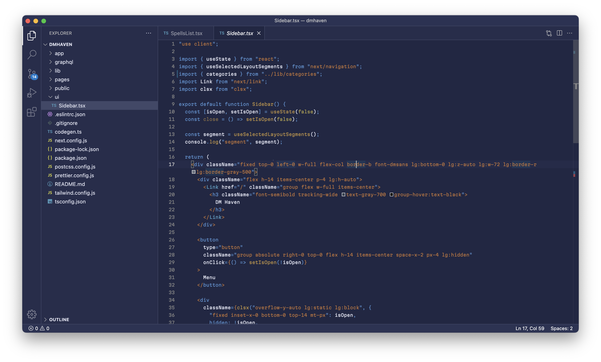

## Blueprint theme

Solid blue theme with minimal highlighting and relatively modest constrast. I decided to create this theme when I was suffering from migraine and every theme was way too contrast for my tired eyes.

The aesetetics of old-timey blueprints was a major inspiration. Overall, this theme attempts to use warm colors for syntax highlighting while staying coldish blue in the background. It might not be everyone's cup of tea, but it helped me struggle through a couple of migraines.

The colors are insipired by one of [Zed Editor](https://zed.dev) themes, and tokens are based on Nord Theme tokens. Philosophically I was also inspired by Niki Tonsky's Alebaster theme for [Sublime Text](https://github.com/tonsky/sublime-scheme-alabaster) and [VS Code](https://github.com/tonsky/vscode-theme-alabaster).

I have only tested this theme with a TypeScript project, and I am not sure how well this theme will play with other languages. I am always open to suggestions and bug reports tho :)
